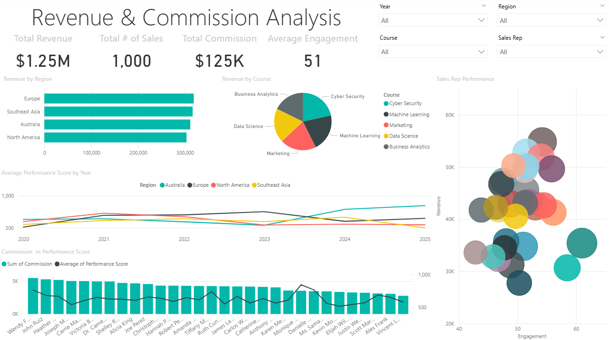

# Revenue & Commission Analysis Dashboard

## Project Overview
This project demonstrates my skills in data analysis and visualization, specifically using **Power BI** and **Python**. The **Revenue & Commission Analysis Dashboard** provides a comprehensive analysis of sales performance across different regions, courses, and sales representatives. The dashboard includes various charts and metrics that allow stakeholders to derive insights into revenue trends, commission structures, and performance scores.

---

## Project Showcase

You can view the **Revenue & Commission Analysis Dashboard** preview below:



---

## Dashboard Features

The **Revenue & Commission Analysis Dashboard** allows users to explore sales performance from various angles:

### Filters
- **Year**: Filter data by year (2015 to 2025).
- **Region**: Filter data by sales region.
- **Course**: Filter data by course.
- **Sales Rep**: Filter data by individual sales representatives.

### Overview Metrics
- **Total Revenue**: The total revenue generated by the sales.
- **Total Sales**: The total number of sales made.
- **Total Commission**: The total commission earned by sales reps.
- **Average Engagement**: The average engagement score across all sales reps.

### Charts
1. **Bar Chart: Revenue by Region**  
   This bar chart displays total revenue by region, allowing for comparisons between different regions.

2. **Pie Chart: Revenue by Course**  
   A pie chart that shows the distribution of revenue across various courses.

3. **Line Chart: Average Performance Score by Year**  
   A line chart showing the average performance score of sales reps over time, highlighting trends.

4. **Line and Stacked Column Chart: Commission vs. Average Performance Score by Sales Rep**  
   This dual-axis chart compares commission earnings to performance scores by individual sales reps. It helps assess the relationship between performance and earnings.

5. **Scatter Plot: Sales Rep Performance**  
   A scatter plot that visualizes the relationship between **Engagement Scores** and **Revenue/Commission** for each sales rep. The bubble size represents the **total sales** made by each rep.

---

## Technologies Used

- **Power BI**: For creating interactive visualizations and dashboards.
- **Python**: Using libraries such as **Pandas** and **NumPy** to generate mock data and preprocess it for analysis.
- **Jupyter Notebook**: For scripting the data generation process.

## Project Files

1. **[Sales_Data Jupyter Notebook](Sales_Data.ipynb)**
   This Python Jupyter notebook generates **mock sales data** to simulate a real-world dataset. It demonstrates how to use **Python** and **Jupyter** for data manipulation, random data generation, and preprocessing.

2. **[mock_sales_data.csv](mock_sales_data.csv)**  
   A CSV file containing **mock sales data** generated by the Jupyter notebook. This dataset includes key variables like **Sales Rep**, **Region**, **Course**, **Revenue**, **Commission**, and **Engagement Score**.

3. **[Revenue & Commission Analysis Dashboard.pbix](Revenue%20&%20Commission%20Analysis%20Dashboard.pbix)** 
   The **Power BI dashboard** file. This contains the visualizations and metrics that provide insights into the sales data. The dashboard includes:
   - Total Revenue, Total Sales, Total Commission, Average Engagement
   - Bar Chart: Revenue by Region
   - Pie Chart: Revenue by Course
   - Line Chart: Average Performance Score by Year
   - Line and Stacked Column Chart: Commission vs. Average Performance Score by Sales Rep
   - Scatter Plot: Sales Rep Performance

4. **[Dashboard_Preview.png](Dashboard_Preview.png)** 
   A **screenshot** of the Power BI dashboard, providing a preview of the visualizations and layout of the final report.

---

## How to Use the Dashboard

1. **Download the Files**:
   - Clone this repository to your local machine using the command:
     ```bash
     git clone https://github.com/daphnedanaraj/revenue-commission-analysis.git
     ```
   - Open the **Revenue & Commission Analysis Dashboard.pbix** file in **Power BI Desktop**.

2. **Data Preparation**:
   - The mock sales data is already available in the **mock_sales_data.csv** file, but you can re-generate the data using the **Sales_Data Jupyter Notebook** if needed.

3. **Filter and Interact**:
   - Use the **filters** on the dashboard to explore the data by different years, regions, courses, and sales reps. Visualize trends and relationships between commission, performance, and revenue.


### Suggestions for Improvement (Optional):
- Add real-world data (e.g., from a public dataset) to enhance the mock data’s realism.
- Integrate additional **data cleaning** or **transformations** in the Python notebook.
- Expand the Power BI dashboard with more detailed charts (e.g., trend analysis by course, regional performance comparisons, etc.).

---
